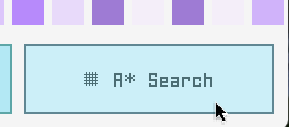
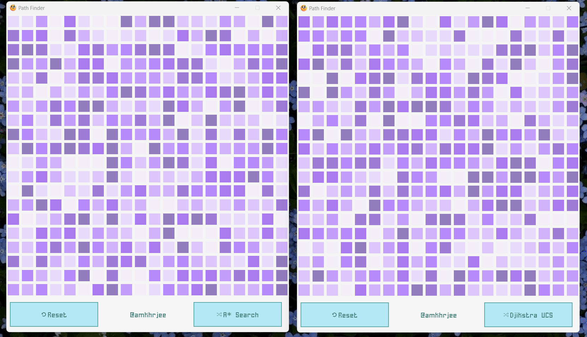

# Pathfinder

Cool visualisations for different search algorithms!

## What are those purple blocks?

Well, think of them as hills and valleys. The more purple the greater the height of the hill. The lighter the shallower the valley. Thus, the best paths are those that navigate to the target via blocks that have the least contrast of colors between them.


## Demo


Algorithms Supported:

- A* Search
- Local Beam Search
- Uniform Cost Search
- Depth First Search
- Breadth First Search




## How to run on your computer

Follow these steps:

1. Download the `Pathfinder_Portable_Windows_amd64.zip` file from the [latest release](https://github.com/amkhrjee/pathfinder/releases/latest).

2. Extract the zip into a folder.

3. Run `pfinder.exe` by double-clicking. 

4. If you see a Windows dialogue saying the program might be unsafe, click on "Run Anyway". 

## Development Setup

### Windows

Make sure to have the `raylib.dll` and `style_bluish.rgs` files in the root directory. 

Also, having `gcc` on the system Path is must.

Run the following to run the binary:

```
go env -w CGO_ENABLED=1
go run ./main.go
```
To build the binary without the debug console, run:

```
go build -tags opengl21 -ldflags "-H=windowsgui -s -w"
```