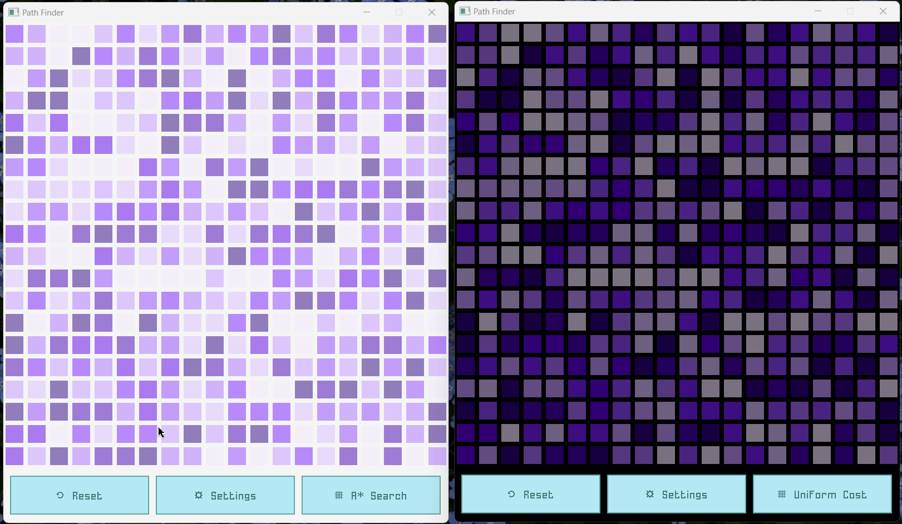

# Pathfinder

Cool visualisations for different search algorithms!

## What are those purple blocks?

Well, think of them as hills and valleys. The more purple the greater the height of the hill. The lighter the shallower the valley. Thus, the best paths are those that navigate to the target via blocks that have the least contrast of colors between them.


## Demo

Currently only two algorithms are supported: A* & Uniform Cost Search (Djikstra's Search)

Here's a side by side comparison of the two (although not technically fair since the grids are different)



## How to run on your computer

### Windows

Make sure to have the `raylib.dll` and `style_bluish.rgs` files in the root directory. 

Also, having `gcc` on the system Path is must.

Run the following to run the binary:

```
go env -w CGO_ENABLED=1
go run ./main.go
```
